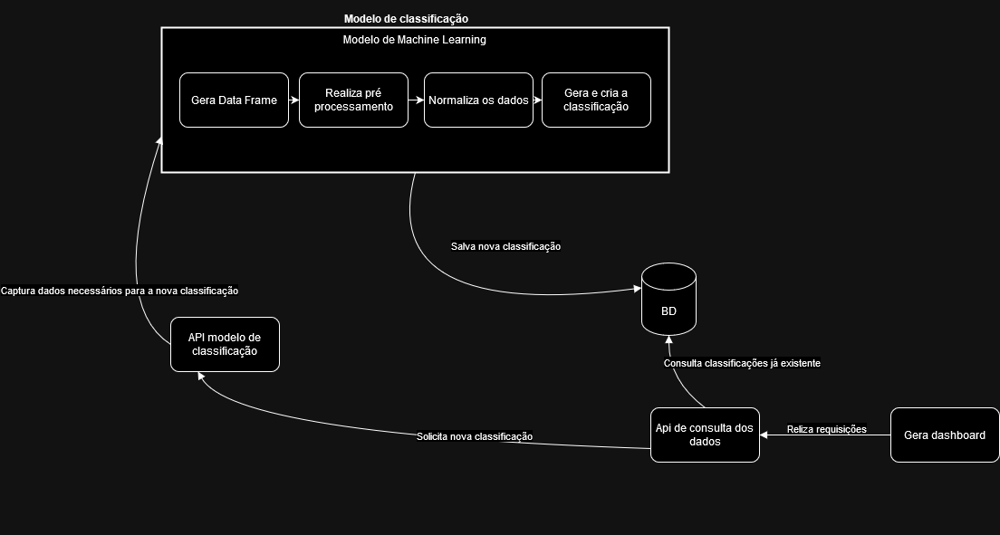

# TC3 - Classificação de Comentários no Instagram

## Descrição do Projeto

O presente projeto **TC3**, foi desenvolvido como parte da atividade avaliativa da fase 3 da pós-graduação **Machine Learning Engineer**.

## Abordagem Proposta

O trabalho desenvolvido foca em encontrar a melhor abordagem para a classificação de texto, definindo os melhores pré-processamentos, extração de features e modelos, com o intuito de maximizar a precisão do sistema. Para isso, foram utilizados dados textuais de comentários e posts de perfis do Instagram, com o objetivo de gerar insights sobre os sentimentos dos seguidores de cada perfil analisado.

O objetivo principal é criar um sistema de classificação de texto que prediz se um comentário de post no Instagram pode ser categorizado como **BOM**, **RUIM** ou **NEUTRO**, utilizando apenas os textos dos comentários e posts.

Além disso, o projeto se propõe a gerar um **dashboard** que quantifica as ocorrências das classificações para cada perfil analisado, considerando os posts recentes e os comentários mais populares, permitiando um interpretação dos resultados obtidos como insights.

## Estrutura do Projeto

O projeto está estruturado em quatro partes principais:

1. **API de Consulta ao Modelo**: Uma API desenvolvida em **FastAPI** que permite inserir dados e consultar o modelo de classificação.
2. **Modelo de Machine Learning**: Um modelo de classificação de texto, utilizando **Logistic Regression**, para predizer as categorias BOM, RUIM ou NEUTRO.
3. **Banco de Dados**: Armazena os dados relevantes dos comentários e suas respectivas classificações.
4. **Dashboard**: Exibe as métricas e insights, permitindo visualizar a distribuição das classificações entre diferentes perfis.

## Detalhes da Implementação

### 1. API de Consulta ao Modelo

A **API** foi construída usando **FastAPI** e possui duas rotas principais:

- **/fetch_training/{username}**: Esta rota utiliza um username como parâmetro query, e é usada para inserir dados de um perfil de usuário que será utilizado como treinamento para o modelo de Machine Learning.
- **/fetch/{username}**: Esta rota utiliza um username como parâmetro query, e é usada para consumir o modelo de ML, retornando a classificação dos comentários do perfil submetido, utilizando o melhor modelo treinado.

### 2. Modelo de Machine Learning(Logistic Regression)

O modelo é consumido através de um pkl, _best_model.pkl_ fonecido para a api, com utilitário. Esse modelo foi obtido através do estudo realizado nos arquicos _sklearn_model_2_class_ e _sklearn_model_3_class_ na raiz do projeto, de forma a encontra o melhor modelo para a abordagem proposta. O estudo também é explicado em forma de video, em >url<.

De forma simplificado, é realizado um pré processameto dos comentários coletado, realizado divisão em dataset de treino e teste, e realizada um gridSearchCV para encontrar os melhores hiperparâmetros dos modelos testado, As etapas incluem:

- Pré processamento.
  - Coleta dos dados.
  - Limpeza dos comentário,
  - Discretização das classes do dataset.
  - Limpeza de linhas duplicadas.
  - remoção de stop word.
  - tokenização das palavras dos comentários.
- Busca do melhor modelo.
  - Definição discretizada de para busca de hiperparâmetros.
  - Iteração entre os modelos pré definidos.
  - Cross validation.
  - Plot do gráficos para compreesão e validação.
  
### 3. Banco de Dados

Este parte do projeto é um banco relacional que armaza algumas informações coletadas pela API (API de Consulta ao Modelo), é também é usado pela api que apresenda os dados no dashboar, sendo que a única forma de inserção de dados para o banco é feita pela api pelas rotas **/fetch_training/{username}** e **/fetch/{username}**, para dados de treinamento e dados para classificação respectivamente.

### 4. Dashboard

O Dashborar do projeto é uma aplicação simple, que se limita a mostrar os perfis buscados, com seus posts e comentários, mostrado a classificação resultante do modelo. O Dashboard permite também a requisição de um novo perfil ao modelo utilizando uma simples barra de pesquisa.

Baixo segue uma imagem referente a arquitetura proposta:

